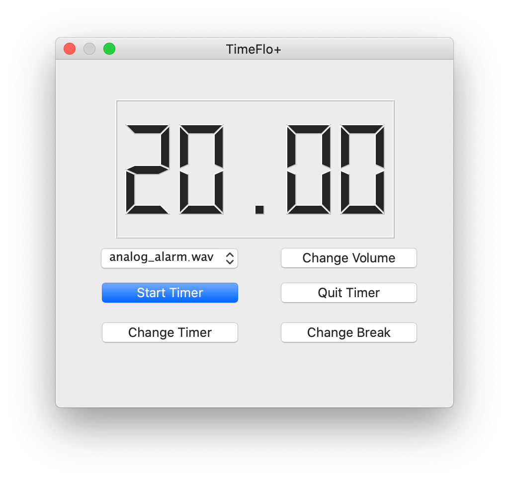

# TimeFlo
Copyright &copy; 2021 Andrew Free

TimeFlo is an implementation of a
[Pomodoro&reg;](https://en.wikipedia.org/wiki/Pomodoro_Technique)-like
timer for breaking out of flow state.

This document will help you get the dependencies installed and instruct the user how to run the timer program. 
## Status and Roadmap

* [X] Requirements complete.
* [X] Project plan complete.
* [X] Design complete.
* [X] Implementation complete.
* [X] Validation complete.

## Build and Run

Universal
1. Create a python virtual enviroment.
```python3 -m venv env```
2. Activate the enviroment.
```source ./env/bin/activate```
3. Upgrade pip
```pip install --upgrade pip```
4. Install the requirements 
```pip install -r requirements.txt```
5. Run the timer. This can also be bound to some hotkey using system sofware to make launching it eaiser. 
```python timer.py```
6. A Qt window should pop up and you should be able to interact with the timer from there. When starting any session the interface will update every minute. 

M1 Mac users  
If
```pip install -r requirements.txt```
fails to install PyQt5:
1. Install Qt 
```brew install qt5```
2. Make qmake accessible
```brew link qt5 --force```
3. Try
```pip install -r requirements.txt```
again.

## Testing

To run tests, go to the root directory and run the command below. It will run through all the state changes. Given the fact that it fully tests the time required to step through everything these tests could take a while to run.
```
python -m pytest
```

## Licensing

This program includes the LGPL V3 license for usage of Qt

## Interface 

<p align="center"></p>

## Development Docs

Development documentation is available for TimeFlo, including:

* [Requirements Specification](docs/requirements.md)
* [Project Plan](docs/plan.md)
* [Design Doc](docs/design.md)
* [V&amp;V Report](docs/vnv.md)
